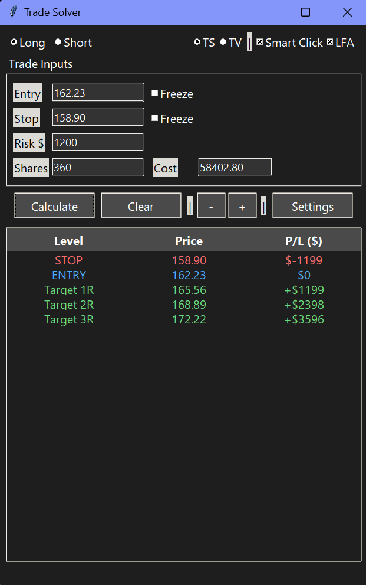

# Trade Solver

A lightweight Windows desktop calculator for active traders. Given an entry price, stop loss, and dollar risk, Trade Solver computes position size, cost basis, and profit/loss at configurable R-multiple targets. It also supports **Smart Click** — click directly on a price in TradeStation (or any charting platform) and the app reads it via OCR, filling in Entry and Stop automatically.



---

## Features

### Core sizing

- **Position sizing** — Enter any three of Entry, Stop, Risk $, and Shares; the fourth is calculated automatically.
- **Live re-solve** — After the initial calculation, changing Stop, Shares, or Cost automatically re-derives the other fields using Entry and Risk $ as fixed anchors.
- **Stop offset modes** — Stop can be entered manually, as a **percentage** of entry, or as a fixed **dollar amount per share** below/above entry. Mode picker is inline on the Stop row. Each mode keeps its own persistent value, so flipping between % and $ recalls the last value used in that mode. Long/Short polarity is honored automatically.
- **Slippage adjustment** — Separate **Entry** and **Exit** slippage, each toggleable independently and configurable as % or $. When enabled, slippage reduces position size to keep the worst-case loss within your Risk $ budget, and the table's PnL column shows post-slippage values (header reads `P/L ($) (net)`). Each side keeps its own persistent value per mode.
- **Configurable profit targets** — Define up to 10 R-multiple targets, each with a custom color. Default: 1R, 2R, 3R (green).

### Smart Click (OCR automation)

- **TradeStation mode** — Click a price on a chart and the app captures the screen region around your click, runs Tesseract OCR, and fills the next field (alternating Entry / Stop). Clicks inside the calculator window are automatically ignored — including title bar and frame, via Win32 `WindowFromPoint`.
- **TradingView mode** — Toggle to TV mode and the app polls the clipboard. Copy a price label in TV (which copies it to the clipboard) and the app fills the next field. Strict regex requires a decimal point so accidental numeric copies (passwords, IDs) are rejected.
- **Freeze fields** — Checkbox next to Entry and Stop. When frozen, Smart Click always fills the *other* field instead of alternating. The Smart Click checkbox is automatically greyed out when no field is fillable (e.g., both freezes on, or offset mode + Entry frozen).
- **LFA (Long First Arrival)** — Adaptive OCR delay. The app uses `GetForegroundWindow` polling plus a click-time `WindowFromPoint` check to detect when you've just switched apps; on the first OCR after a switch, it waits longer (`lfa_delay`, default 0.5 s) for the chart to finish rendering. Subsequent rapid clicks use a shorter delay (`normal_delay`, default 0.1 s). Status bar shows `OCR: LFA <ms>` or `OCR: normal <ms>` per click.
- **OCR retry** — If an LFA-delay OCR returns no valid price, the app automatically retries once with an extended delay before giving up. A failed retry no longer wipes your prior Entry/Stop — they're restored, and Stop + Shares are tinted yellow until your next successful calculation as a "stale" indicator.
- **Monitor lock** — Smart Click only fires on one user-selected monitor (configurable in Settings). On other monitors, clicks are silently ignored with a `Smart Click off this monitor` status note. This prevents garbage OCR on monitors with different sizes / DPI scaling. Defaults on first launch to whichever monitor the calculator is on.

### UI

- **Dark theme** — Low-distraction dark UI that stays on top of other windows.
- **Always on top** — The calculator floats above your charting platform.
- **DPI-aware** — Coordinates stay accurate on scaled displays (Per-Monitor v2).
- **Adjustable font size** — `+` / `-` buttons to scale the UI.
- **Persistent config** — Window position/size, font size, Risk $, all freeze states, direction, all Stop offset / Slippage values per mode, monitor lock, and all settings are saved atomically to `window_config.json` (with a `.bak` backup on every successful save) and restored on next launch.

### Settings window

The **Settings** button opens a configuration window:

- **OCR Timing** — `Normal Delay` and `LFA Delay` (seconds).
- **TradeStation Capture Region** — Pixel offsets from the click point (Left, Right, Above, Below).
  - **Save Preset…** writes the current capture region to `presets/<name>.json` (filename auto-sanitized).
  - **Load Preset…** picks from a dropdown of saved presets and applies it.
  - Useful for swapping calibrations (chart tooltip vs. watchlist, primary monitor vs. backup, etc.).
- **Smart Click Monitor** — Dropdown lists every detected monitor (e.g. `Monitor 1: 1920×1080 at (0,0)`). Pick one, or `(any monitor)` to disable the lock.
- **Debug** — `Show OCR captures (visual tuning)` checkbox. When on, every OCR click pops up a small always-on-top window showing the **raw screen capture**, the **processed image** Tesseract actually sees (3× upscaled + contrast/sharpness enhanced), the raw OCR text, and the parsed price. Use it to dial in the capture region without trial-and-erroring through trades.
- **Profit Targets** — Add or remove R-multiple rows (1 to 10). Each target has a configurable R-multiple and color. Click the color swatch to pick a new color.

Settings are saved to disk immediately when you click Save (atomic write — a crash mid-write can't corrupt your config).

## Requirements

### Running from source

- Python 3.10+
- [Tesseract OCR](https://github.com/UB-Mannheim/tesseract/wiki) — looked up in this order: `TESSERACT_CMD` env var → bundled `_MEIPASS` folder (when running as .exe) → `C:\Program Files\Tesseract-OCR\` → `C:\Program Files (x86)\Tesseract-OCR\` → PATH.
- Python packages:
  - `pytesseract`
  - `Pillow`
  - `pynput`

Install dependencies:

```
pip install pytesseract Pillow pynput
```

### Running the standalone .exe

No Python installation or additional dependencies required. Tesseract is bundled inside the executable. Just run the latest `price_calc_v*.exe` from `dist/`.

## Usage

### Basic workflow

1. Set your **Risk $** (this persists across sessions and clears).
2. Choose **Long** or **Short** direction.
3. Enter an **Entry** price and a **Stop** price (or use Stop offset mode — see below). The app calculates **Shares** and **Cost** automatically.
4. The output table shows price and P/L at your stop, entry, and each configured R-multiple target.

### Stop offset workflow

1. On the Stop row, choose `manual`, `pct`, or `dollar` from the mode dropdown.
2. In offset modes (`pct` / `dollar`), an **Offset** field appears below the Stop row, and Stop becomes a derived value (read-only, recomputed from Entry ± offset).
3. Long: stop is below entry. Short: stop is above entry. Polarity is automatic from the Long/Short selection.
4. Switching modes recalls the last value you used in that mode.
5. Changes to Entry, Shares, or Risk $ trigger immediate re-solve. Stop stays anchored to the offset.

### Slippage workflow

1. Below Trade Inputs, the **Slippage** row has a section per side (Entry, Exit). Each has a checkbox to toggle on/off, a mode picker (`pct` / `dollar`), and a value field.
2. Enable either side and the app recomputes Shares so that worst-case loss (including all enabled slippage legs) stays within your Risk $.
3. The output table's PnL column header reads `P/L ($) (net)` while slippage is on, and PnL values reflect post-slippage reality (the ENTRY row will show a small loss equal to combined slippage; STOP and Targets shift accordingly).
4. Toggle the side off and Shares + PnL revert to the ideal-fill case.
5. Each (side × mode) keeps its own persistent value.

### Smart Click workflow

1. Open Settings → **Smart Click Monitor** and verify the locked monitor is the one with your chart (defaults to the calculator's current monitor on first launch).
2. Check **Smart Click**.
3. Click on a price in your charting software — the app OCR-reads it and fills **Entry**.
4. Click on a second price — the app fills **Stop**, auto-detects Long/Short direction, and calculates everything.
5. Click **Clear** to reset for the next trade setup.

**Freeze mode:** Check the **Freeze** box next to Entry or Stop to lock that field. Smart Click will always fill the unlocked field, skipping the alternation cycle. Useful when your entry is fixed and you want to rapidly test different stop levels (or vice versa).

**Offset mode + Smart Click:** When Stop is in offset mode, Smart Click only fills Entry (Stop is derived). If you also freeze Entry, the Smart Click checkbox auto-disables and the status bar shows `Offset mode + Entry frozen — Smart Click idle`.

### Tuning OCR

If OCR misreads prices:

1. Open Settings, enable **Debug → Show OCR captures**.
2. Make a Smart Click on the chart. The OCR Debug window will show the raw screen capture and the processed image Tesseract actually sees.
3. Adjust **TradeStation Capture Region** offsets (Left/Right/Above/Below) so the box tightly bounds the price text — too large captures noise; too small clips digits.
4. Save the working region as a preset (**Save Preset…**) so you can recall it later.

### Input scenarios

The calculator flexibly solves for the missing variable:

| Given                     | Computes       |
|---------------------------|----------------|
| Entry + Stop + Risk $     | Shares, Cost   |
| Entry + Stop + Shares     | Risk $, Cost   |
| Entry + Shares + Risk $   | Stop, Cost     |
| Entry + Cost (no Shares)  | Shares         |

In offset mode, Stop is always Entry ± offset, and the missing variable is derived from the others (Shares ↔ Risk $ given Entry + offset).

### Re-solve behavior (manual mode)

Once all fields are populated, editing any derived field triggers an automatic re-solve with **Entry** and **Risk $** held constant:

| Field changed | Re-derives                                                                            |
|---------------|---------------------------------------------------------------------------------------|
| Stop          | Shares                                                                                |
| Shares        | Stop                                                                                  |
| Cost          | Shares + Stop (with status note if Cost was rounded down to fit a whole share count)  |

In offset modes (pct/dollar), Stop is anchored to the offset; editing Shares re-derives Risk $ instead.

## Project structure

```
price_calc/
  price_calc_III.py       # Application source (single file)
  price_calc_III.spec     # PyInstaller build spec
  icon3.ico               # Application icon
  window_config.json      # Auto-generated settings/config
  presets/                # Capture-region presets (auto-created on first save)
  requirements.txt        # Python dependencies
  _smoketest.py           # Headless test harness (24 tests)
  venv/                   # Build virtual environment (Python 3.10)
  dist/
    price_calc_v16.exe    # Latest standalone executable (older versions retained for rollback)
```

## Building the .exe

Create a venv and build from the `price_calc/` directory:

```
python -m venv venv
venv\Scripts\pip install pyinstaller pytesseract Pillow pynput
venv\Scripts\python _smoketest.py
venv\Scripts\pyinstaller price_calc_III.spec --noconfirm
```

The spec file (`price_calc_III.spec`) handles bundling Tesseract OCR and the application icon automatically. After building, hand-rename `dist/price_calc_III.exe` to `dist/price_calc_v{N}.exe` to keep the prior version for rollback.

Always run the smoketest (`venv\Scripts\python _smoketest.py`) before building. It exercises calculation, persistence, presets, monitor lock, LFA timestamp logic, and config corruption handling without bringing up the UI.

## Limitations

- **Windows only** — Uses `ctypes.windll` for DPI awareness, foreground-window detection, monitor enumeration, and `ImageGrab` for screen capture, all Windows-specific.
- **Single-monitor OCR** — By design (see Monitor lock). Different monitors have different DPI / sizes; one fixed pixel capture box can't reliably cover multiple monitors. Per-monitor OCR profiles are not currently supported.
- **OCR accuracy** — Tesseract reads the screen image around your click. Dark themes, unusual fonts, overlapping UI elements, or low contrast can cause misreads. The app preprocesses (grayscale, 3× upscale, contrast/sharpness) and applies regex filtering, but OCR is inherently imperfect. Use Debug mode to tune the capture region.
- **No broker integration** — Standalone calculator. It does not connect to any brokerage, place orders, or access account data.
- **Static R-multiples** — Targets are fixed R-multiples of the initial risk-per-share. They do not account for trailing stops or dynamic exits.
- **Slippage is approximate in scenario-C** — When Stop is the unknown (Entry + Shares + Risk → Stop), slippage at the exit price is approximated using the entry price for solving (the difference is sub-cent for typical 1–5% stops; full iteration is not implemented).

---

## Disclaimer

**This software is provided for educational and informational purposes only. It is not financial advice, and nothing in this application constitutes a recommendation to buy, sell, or hold any security.**

- Calculations are based on simple arithmetic. They **do not account for commissions, fees, spread, partial fills, or market impact** beyond the optional slippage adjustment.
- OCR-based price reading is a convenience feature and is **not guaranteed to be accurate**. Always verify prices visually before acting on them.
- The authors and contributors of this software accept **no liability** for any trading losses, errors, or damages arising from the use of this tool.
- **Use at your own risk.** You are solely responsible for your own trading decisions.

## License

[MIT](LICENSE) © 2026 Troy Folmer
